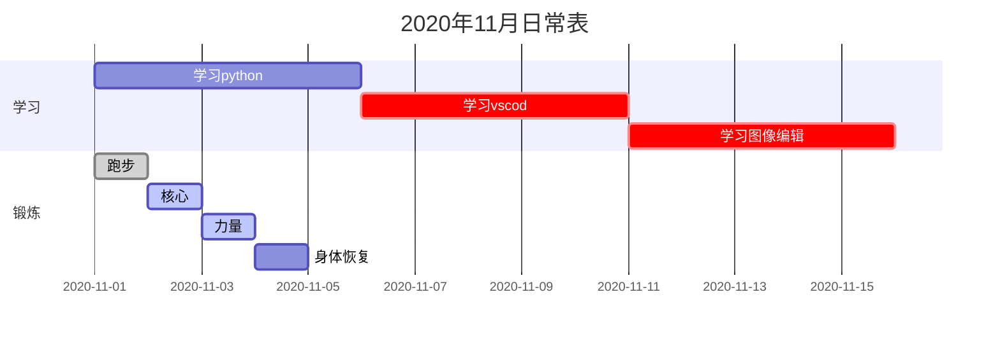

注意一下代码

```
gantt
    title 2020年11月日常表
    dateformat YYYY-MM-DD
    section 学习
    学习python:des1,2020-11-01,5d

    学习vscod:crit,des2,after des1,5d

    学习图像编辑:crit,des3,after des2,5d

    section 锻炼
    跑步      :done,des4,2020-11-01,1d

    核心      :active,des5,after des4,1d

    力量      :active,des6,after des5,1d

    身体恢复   :24h
```

#注意要点

1. gantt：表示图表类型为甘特图。
2. titile：标注主题。
3. dateformat：指定日期格式（Y 表示年，M 表示月，D 表示日）。YYYY-MM-DD（2019-03-14），YY-MM-DD(19-03-14)
4. section： 项目关键字，空格之后输入项目名称。
5. 任务行： section 后每一行为一个任务。第一个字符串为任务名称，之后以:开头，添加任务属性。（就是写下内容）
6. 任务描述：在 des1、des2 位置添加任务描述，其它任务引用时直接引用 des1 就可以。
7. ==after: 描述任务时间关系。des3, after des2 表示 des3 紧跟在 des2 之后。==

```任务时长有三种方式：
时间范围 如：2014-01-06,2014-01-08
指定天数 如：5d
指定开始日期+天数 如：2014-01-06，5d
```

---

```
常见任务状态：
done 已完成
active正在进行
crit 关键任务
默认任务都为待完成状态
```
