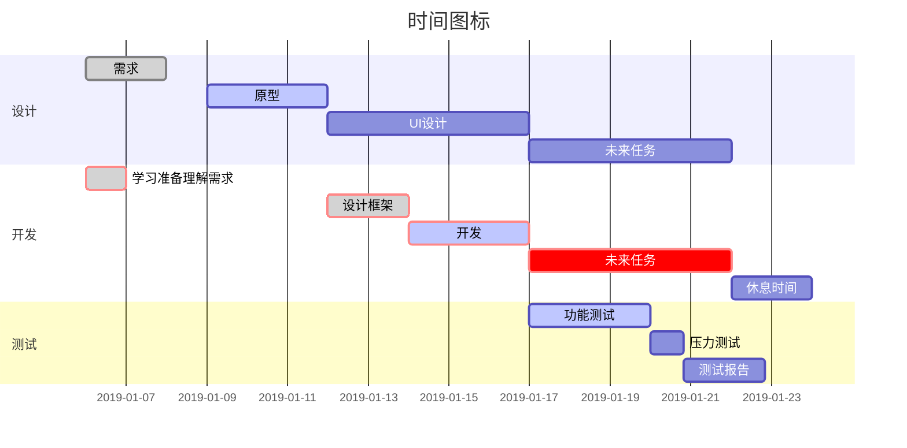
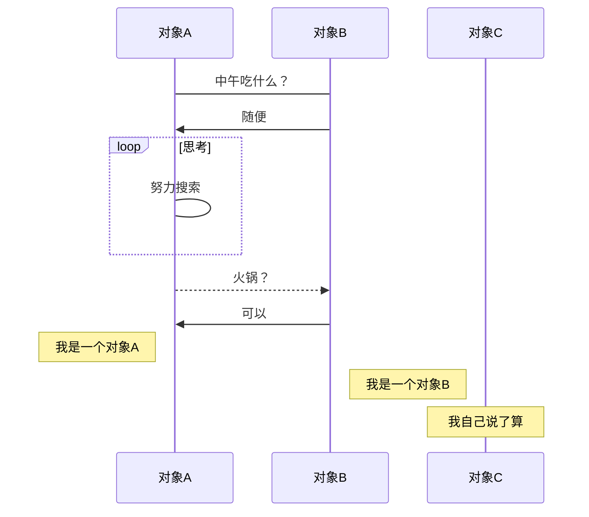

<h1 style=color:red align=center>个人文档</h1>
-
开始我的测试

## 我的第一个测试文档
- 大地工作
  - 点小部门
  - 客服部

### 配送公司

### 资金返回

## 我的第二个测试文档

###家人安排工作
- 建筑工作
  - 待定
  - 待定

###待定工作

- [ ] 完成
- [ ] 未完成


<h2 style=color:red align=center>目录</h2>

[toc]




---



---

```sequence
Title:时序图示例
客户端->服务端: 我想找你拿下数据 SYN
服务端-->客户端: 我收到你的请求啦 ACK+SYN
客户端->>服务端: 我收到你的确认啦，我们开始通信吧 ACK
Note right of 服务端: 我是一个服务端
Note left of 客户端: 我是一个客户端
Note over 服务端,客户端: TCP 三次握手
participant 观察者⌛
```

# 自主学习flow
```flow
str=>start: 开始
op=>operation: 学习
op1=>operation: 目标
cond=>condition: 过程
e=>end

str(right)->op->op1->cond
cond(yes)->e
cond(no)->op

```

```sequence

A->B:how are you?

B-->>A:fine.
```

