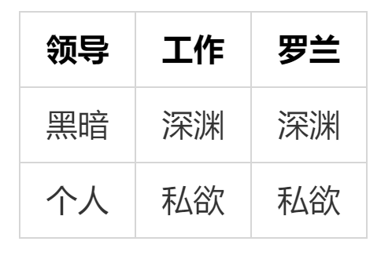

<div align=center>我的工作日记</font></div>
-
<!--注释看一下上方的标记-->

[toc]

## 大地工作日记

 - 电销
   - 配送制度制定
   - 配送公司对接
 - 客服服务部
   - 微信公众号
   - 增值服务

| 领导 | 工作 | 罗兰 |
| ---- | ---- | ---- |
| 黑暗 | 深渊 | 深渊 |
| 个人 | 私欲 | 私欲 |

## 其他工作日记

==工作未稳定==
&emsp;&emsp;使用空格全角⏮


&nbsp;&nbsp;使用空格半角⏭

`光明`、`黑暗`



我的[^我的]


```flow
st=>start: 供应商
op1=>operation: 分公司提供合作合同
op2=>operation: 噢噢噢噢
op=>operation: 总公司对接合作
cond=>condition: 是否能合作
cond1=>condition: 技术人员对接
e1=>end
st(right)->op2->op1->op->cond->cond1
cond(yes)->cond1
cond(no)->op1
cond1(yes)->e1
cond1(no)->op1
```

<!--注意operation:+空格+文字描述-->

```flow
st=>start: Start|past:>http://www.google.com[blank]
e=>end: End:>http://www.google.com
op1=>operation: get_hotel_ids|past
op2=>operation: get_proxy|current
sub1=>subroutine: get_proxy|current
op3=>operation: save_comment|current
op4=>operation: set_sentiment|current
op5=>operation: set_record|current

cond1=>condition: ids_remain空?
cond2=>condition: proxy_list空?
cond3=>condition: ids_got空?
cond4=>condition: 爬取成功??
cond5=>condition: ids_remain空?

io1=>inputoutput: ids-remain
io2=>inputoutput: proxy_list
io3=>inputoutput: ids-got

st->op1(right)->io1->cond1
cond1(yes)->sub1->io2->cond2
cond2(no)->op3
cond2(yes)->sub1
cond1(no)->op3->cond4
cond4(yes)->io3->cond3
cond4(no)->io1
cond3(no)->op4
cond3(yes, right)->cond5
cond5(yes)->op5
cond5(no)->cond3
op5->e
```